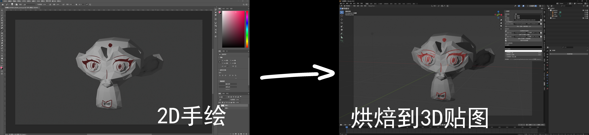

# Blender_Texture_Bridge

Blender 插件：**纹理桥**  
> 在 Blender 与外部绘制流程之间搭建桥梁 —— 导出相机 / UV / 渲染参数，生成绘制用画布，并能基于导出的 JSON 精确重建相机，把 3D 绘制结果准确投射并烘焙回模型的 UV 贴图。

## 功能特性

- **相机与 UV 导出**
  - 支持导出指定相机或当前视口的投影参数、UV 布局以及 `metadata.json` 文件。
- **画布生成**
  - 一键生成两张空白画布：UV 画布、3D 投影画布，方便在外部软件（如 Photoshop、Substance Painter）中绘制。
- **3D 绘制投射回烘焙**
  - 按 `metadata.json` 精确重建相机，将外部绘制的 3D 贴图投射回模型 UV，并输出 PNG。
- **可见性与遮挡支持**
  - 通过“法线朝向 + 深度图”双重判定，避免背面与被遮挡面被错误投射。
- **可见性遮罩导出**
  - 可单独生成一张可见性遮罩（黑/白图），用于调试或合成蒙版。
- **参数可控**
  - 可配置可见/不可见区域颜色、正面阈值（度）、深度容差比例，以及是否反相输出。

## 安装

1. 下载/克隆本仓库。
2. 在 Blender 中打开 **编辑 > 首选项 > 插件 > 安装**。
3. 选择 `zip` 包或插件文件夹，勾选启用 `Blender_Texture_Bridge`。

## 使用方法

1. 打开 **3D 视图 > N 面板 > 纹理桥**。
2. 设置：
   - 渲染来源：相机 / 视口
   - 输出目录
   - 目标物体（网格）
   - Metadata JSON 路径
   - UV 尺寸
3. 点击 **导出（相机/UV）**，生成 JSON 与 UV 信息。
4. 点击 **生成两张空白画布**，得到：
   - `xxx_paint_uv.png`
   - `xxx_paint_3d.png`
5. 在外部软件中绘制完成后：
   - 指定绘制结果路径（UV 或 3D）
   - 点击 **应用绘制 → 烘焙贴图**
6. 如需调试可见性，点击 **保存可见性遮罩**。

## 参数说明

- **渲染来源**
  - `相机`：使用选定相机的参数
  - `视口`：直接使用视口尺寸和视角
- **正面阈值（度）**
  - 抑制掠射角抖动。默认 `0.5°`
- **深度容差（比例）**
  - 相对于包围盒对角线的容差，避免 Z-Fighting。默认 `0.001`
- **反相遮罩（可见=黑）**
  - 控制遮罩颜色语义。默认开启。
- **可见颜色 / 不可见颜色**
  - 用于生成可见性遮罩时的像素颜色。

